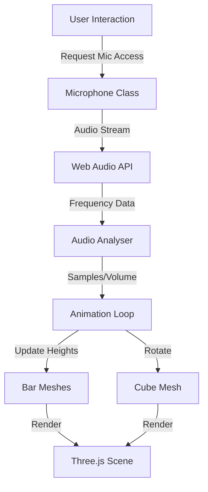

# 3D Audio Cube Visualizer Implementation Plan

## Overview

Create a Three.js scene with a rotating cube where bars extend from each of the 6 faces. Bar heights will dynamically change based on real-time microphone input, using the Web Audio API pattern from the example files.

## Architecture

## Implementation Steps

### 1. Create Microphone Utility (`src/microphone.ts`)

- Port the `Microphone` class from `docs/example_files/microphone.js` to TypeScript
- Maintain the same API: `getVolume()` and `samples` getter
- Use `getByteTimeDomainData()` for audio samples
- Handle microphone permission requests

### 2. Create Bar Geometry Helper (`src/bar.ts`)

- Create a function to generate bar geometry/mesh
- Each bar will be a `THREE.BoxGeometry` or `THREE.CylinderGeometry`
- Store reference to mesh for height updates

### 3. Update Main Scene (`src/main.ts`)

- **Setup**: Create scene, camera, renderer (already partially done)
- **Cube**: Keep existing cube, ensure it rotates continuously
- **Bars**: Create bars on each of the 6 cube faces
- Calculate positions for bars on each face (e.g., 5x5 grid per face = 25 bars × 6 faces = 150 bars)
- Position bars extending outward from each face
- Store bars in arrays grouped by face
- **Microphone**: Initialize microphone with appropriate `fftSize` (e.g., 512)
- **Animation Loop**:
- Get microphone samples/volume
- Map audio data to bar heights (similar to `bar.update()` pattern: `micInput * 1500`)
- Apply smoothing to bar heights (like `height -= height * 0.01`)
- Update bar mesh scales/positions based on audio data
- Rotate cube continuously
- Render scene

### 4. User Interaction

- Add a start button or auto-start with permission prompt
- Handle microphone permission errors gracefully

## Key Implementation Details

**Bar Height Updates** (from `docs/example_files/bar.js`):

- `const sound = micInput * 1500` - scale audio input
- If sound > current height: set to sound
- Otherwise: `height -= height * 0.01` (smooth decay)

**Microphone Data** (from `docs/example_files/microphone.js`):

- Use `analyser.getByteTimeDomainData(dataArray)`
- Normalize: `(e / 128 - 1)` for samples
- Calculate volume: RMS of normalized samples

**Bar Distribution**:

- Distribute bars evenly across each face
- Map microphone samples to bars (e.g., use sample index modulo number of bars)
- Ensure bars extend outward from cube surface

## Files to Modify/Create

1. **`src/microphone.ts`** (new) - Microphone class ported to TypeScript
2. **`src/main.ts`** (modify) - Main scene with cube, bars, and animation loop
3. **`index.html`** (optional) - Add start button if needed

## Dependencies

- Three.js (already installed)
- Web Audio API (browser native)